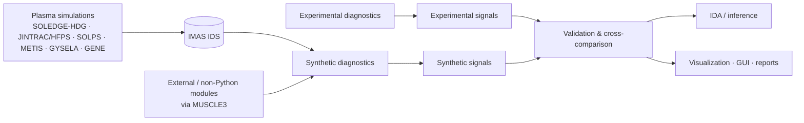

# TWINTOK

**TWINTOK** is an **IMAS-centred digital twin framework for synthetic diagnostics and validation of plasma simulations**.

> **Development status:** TWINTOK is under active development. APIs, dependencies, workflows and installation procedures may change as the framework is consolidated.

TWINTOK connects plasma simulations to experimentally measurable quantities through synthetic diagnostics. Its goal is to provide a common, modular environment for **simulation-to-experiment comparison, model validation, uncertainty-aware analysis and multi-device deployment**.


[SOLEDGE-HDG simulation of WEST discharge validated with synthetic camera]

The framework is developed in the context of the **EUROfusion Digital Twin Environment (DTE)** and the **TWINTOK-IDA** project.

---

## What TWINTOK does

TWINTOK provides a common workflow to:

- read simulation and experimental data through **IMAS IDS**
- run **synthetic diagnostics** on plasma simulations
- generate synthetic signals in the same measurement space as real diagnostics
- compare synthetic and experimental signals consistently
- connect multiple plasma modelling codes and externally developed diagnostic modules
- visualize plasma fields, diagnostics and time traces through a common GUI
- support automated validation and report generation
- provide forward models for **Integrated Data Analysis (IDA)** and future uncertainty-aware validation workflows

The long-term objective is an operational, portable Digital Twin workflow for **WEST, TCV, ITER and any IMAS-compatible machine**.

---

## Concept



The central principle is simple:

**plasma state → forward model → synthetic measurement → direct comparison with experiment**

---

## IMAS-centred architecture

TWINTOK uses **IMAS** as the common data layer between plasma simulations, diagnostic geometry, synthetic diagnostics and experimental data.

This provides:

- a standardized interface between modelling codes and diagnostics
- portability between IMAS-enabled fusion devices
- consistent handling of geometry, equilibria and diagnostic metadata
- direct compatibility with ITER-oriented workflows
- a common basis for synthetic diagnostics, validation and inference

---

## Synthetic diagnostics

TWINTOK follows a modular philosophy: each synthetic diagnostic converts plasma quantities into experimentally measurable observables.

| Diagnostic | Input / physics | Synthetic output | Status |
|---|---|---|---|
| **Interferometry** | `n_e` + diagnostic geometry / line integration | phase shift, line-integrated density | Available; WEST workflow |
| **Bolometry** | plasma radiation + impurity model + diagnostic geometry | chord-integrated radiated power | Available |
| **Visible imaging** | emissivity + machine geometry + ray tracing | synthetic camera images | Under active development |
| **Spectroscopy** | plasma composition + atomic data + optical geometry | synthetic spectral intensities | Workflow available / evolving |
| **Reflectometry (FeDoT)** | `n_e`, fluctuations, magnetic configuration + 2D full-wave propagation | reflected wave, spectra, turbulence observables | O/X-mode workflow available |
| **Doppler reflectometry** | reflectometry + Doppler module | fluctuation / velocity-related observables | Developed / being integrated |
| **Blob analysis** | synthetic or experimental reflectometry signals | skewness, blob size, velocity and statistics | Ongoing workflow |
| **ECE** | `T_e`, `n_e`, `B` + emission / propagation model | temperature profile observables | Ongoing |
| **CECE / ECEI** | temperature fluctuations + ECE physics | fluctuation signals / imaging | Ongoing |
| **IR / thermal imaging** | heat loads + thermal / optical model | synthetic IR observables | External-module integration ongoing |
| **Langmuir-probe PIC models** | edge / sheath plasma parameters | probe observables | External-module integration tested |

### Common forward-model pattern

```text
Plasma quantities
      ↓
Diagnostic physics / forward model
      ↓
Synthetic raw signal
      ↓
Post-processing
      ↓
Experimental observable
```

The same post-processing philosophy can be applied to both **synthetic and experimental data**, enabling consistent validation.

---

## External modules and MUSCLE3

A **MUSCLE3 wrapper** has been tested to integrate non-Python or externally developed modules into the TWINTOK workflow.

Target examples include:

- ECE forward models
- IR thermal models
- Langmuir-probe PIC simulations
- other independently developed diagnostic modules

This allows TWINTOK to remain modular while avoiding the need to rewrite specialized codes in Python.

---

## Plasma modelling interfaces

TWINTOK is designed to work with multiple modelling tools rather than a single plasma code.

Current and targeted interfaces include:

- **SOLEDGE-HDG** — whole-discharge, whole-cross-section core-edge-wall simulations
- **JINTRAC / HFPS** — integrated modelling coupling
- **SOLPS**
- **METIS**
- **GYSELA** — turbulence / fluctuation workflows
- **GENE** — turbulence / fluctuation workflows

Where possible, coupling is performed through **IMAS IDS** to keep the diagnostic layer independent of the source code.

---

## SOLEDGE-HDG as a validation engine

SOLEDGE-HDG is particularly well suited for TWINTOK because it provides:

- time-dependent whole-discharge simulations
- whole-cross-section plasma modelling, from magnetic axis to wall
- evolving magnetic equilibria
- high-order, non-field-aligned unstructured meshes
- realistic plasma-facing-component geometry
- self-consistent density, momentum, ion/electron energy and neutral-fluid modelling
- direct 2D plasma fields for synthetic diagnostics
- strong relevance to **SOL, limiter/divertor, plasma-wall interaction and power-exhaust physics**

Recent WEST limiter-ramp-up studies demonstrate the value of combining SOLEDGE-HDG with experimental diagnostics and synthetic diagnostics to identify both successful predictions and missing edge physics.

---

## GUI and visualization

A common TWINTOK interface is under development to provide:

- simulation and device selection
- synthetic-diagnostic selection
- visualization of 2D plasma quantities such as `n_e` and `T_e`
- simulation time traces
- synthetic and experimental signals side by side
- diagnostic geometry overlays
- validation metrics
- automated report generation

The aim is to provide a **single entry point** for modelers and experimentalists rather than requiring users to manage each diagnostic library independently.

---

## TWINTOK-IDA

TWINTOK is being integrated with **Integrated Data Analysis (IDA)**.

In this framework:

- TWINTOK synthetic diagnostics act as **forward models**
- IDA combines measurements, forward models and physical constraints
- robust likelihoods are used to mitigate outliers
- electron density and temperature profiles can be inferred with uncertainty quantification
- the **Integrated Data Equilibrium (IDE)** workflow provides IMAS-compatible equilibrium reconstruction

The combined framework aims to move from qualitative comparison toward **quantitative, uncertainty-aware validation**.

---

## Current development priorities

- [ ] consolidate a single software environment with coherent dependencies
- [ ] complete IMAS-native multi-device workflows
- [ ] finalize ECE, CECE and ECEI integration
- [ ] extend visible-camera and IR synthetic diagnostics
- [ ] extend reflectometry with pulse-reflectometry workflows
- [ ] consolidate blob-detection and turbulence-statistics workflows
- [ ] complete coupling to integrated and turbulence modelling codes
- [ ] integrate IDA and IDE workflows
- [ ] develop quantitative validation scores and discrepancy detection
- [ ] finalize GUI and automated report generation
- [ ] provide tutorials, examples and user documentation
- [ ] validate and deploy workflows on WEST, TCV, ITER and other IMAS-compatible machines

---

## Installation

Installation is currently being consolidated as part of the development of a **single coherent dependency stack**.

For now:

```bash
git clone <TWINTOK_REPOSITORY_URL>
cd TWINTOK
```

Detailed installation instructions, environment files and dependency versions will be added as the software structure stabilizes.

> If you are collaborating on TWINTOK, please use the development environment agreed within the project team rather than installing individual dependencies independently.

---

## Examples

Example notebooks and workflows will progressively cover:

```text
examples/
├── imas_loading/
├── interferometry/
├── bolometry/
├── reflectometry/
├── visible_imaging/
├── ece/
├── simulation_experiment_comparison/
└── gui/
```

> Directory names above describe the planned documentation structure and may evolve during development.

---

## Related publication

A recent SOLEDGE-HDG / WEST study illustrating the type of simulation-diagnostic validation targeted by TWINTOK is:

**I. Kudashev et al.**  
*Modelling the limiter ramp-up of WEST for addressing the future challenges of ITER*  
**Nuclear Fusion 66 (2026) 076035**  
DOI: `10.1088/1741-4326/ae7812`

Additional publications describing individual synthetic diagnostics and validation workflows will be listed here.

---

## Contributing

TWINTOK is currently developed collaboratively.

Before contributing:

1. open an issue or discuss the proposed development with the project team
2. keep new diagnostics modular and independent of machine-specific assumptions whenever possible
3. use IMAS interfaces for data exchange where applicable
4. document input/output quantities and units
5. add a minimal example or validation case for new forward models

Contribution guidelines will be expanded as the repository matures.

---

## Project status

**Under active development**

TWINTOK is not yet a frozen production release. Interfaces, dependencies and APIs may change without backward compatibility during the development phase.

The current focus is on building a robust and reusable framework before stabilizing public releases.

---

## Collaboration

TWINTOK / TWINTOK-IDA developments involve collaborations across:

- **M2P2 — Aix-Marseille University / CNRS / Centrale Méditerranée**
- **CEA IRFM**
- **Max Planck Institute for Plasma Physics**
- **EPFL**
- **IUSTI**
- WEST and TCV teams
- EUROfusion modelling and Digital Twin activities

---

## Acknowledgements

This work is developed within the framework of the **EUROfusion Consortium** and benefits from collaborations on plasma modelling, synthetic diagnostics, integrated data analysis and experimental validation.

---

## Contact

For scientific questions, collaboration or access to development workflows, please contact the TWINTOK project team.

**Project lead:** Anna Glasser anna.medvedeva@univ-amu.fr
**M2P2 — Aix-Marseille University / CNRS**

---

*TWINTOK — connecting plasma simulations to the measurements of the machine.*
